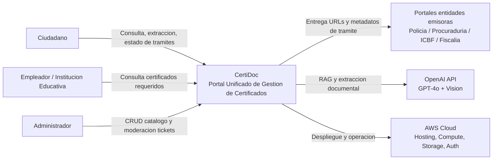
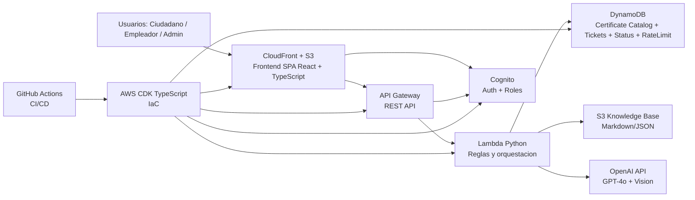
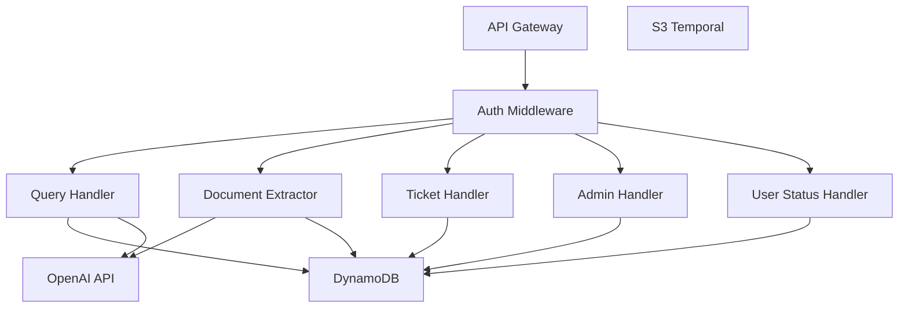
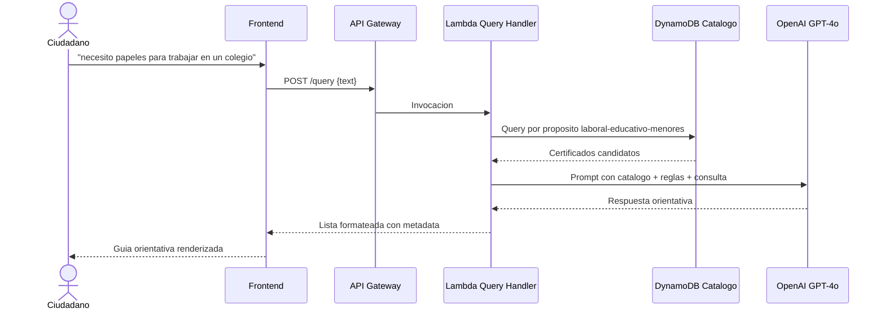
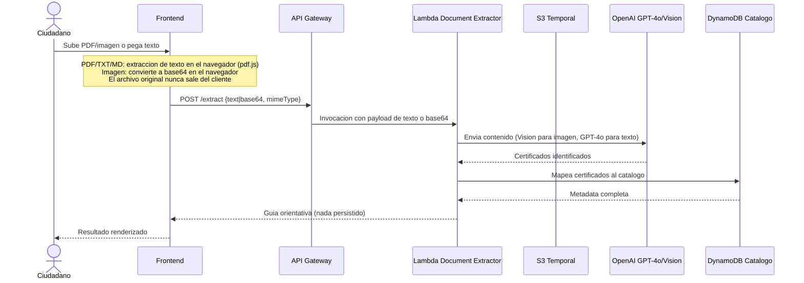
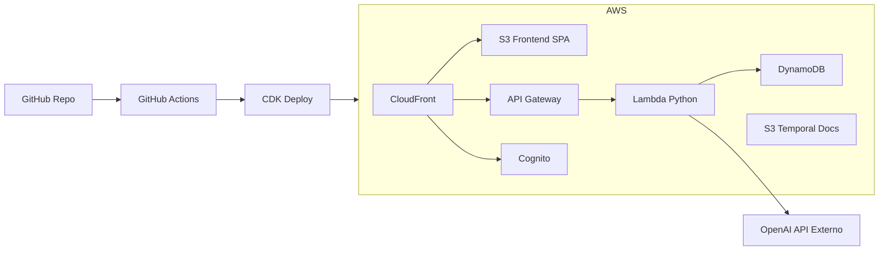
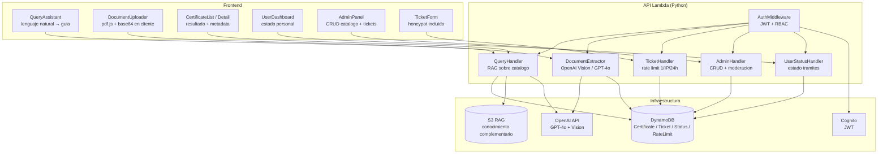

# CertiDoc — Portal Unificado de Gestion de Certificados (Colombia)

Proyecto: https://github.com/hdballestan/ISAIA_gupo1

**Nota de autoria individual:** Este proyecto es individual tras la escision formal del equipo original, autorizada por el docente. El historial de commits es verificable.

**Nota de reestructuracion:** El tema original (Sistema de Alerta Temprana de Desercion Universitaria) fue reemplazado. Motivos: (a) el feedback de la Entrega 1 senalo que el proceso no era claro y la fuente de datos era ambigua; (b) la escision del equipo requeria un proyecto viable para un solo desarrollador. El nuevo tema mantiene complejidad de actores, regulacion y procesos, y corrige el feedback con una fuente de datos publica y procesos explicitamente definidos.

## Datos del proyecto

- **Nombre:** CertiDoc - Portal Unificado de Gestion de Certificados (Colombia)
- **Autor:** Hever Ballesta - hdnallestan@unal.edu.co
- **Repositorio:** `ISAIA_gupo1` - Rama: `entrega_1`
- **Fecha de entrega original:** 28 de marzo de 2025
- **Refactorizacion:** 8 de abril de 2025

## Tabla de Contenidos

1. [Definicion del Problema y Contexto de Negocio](#1-definicion-del-problema-y-contexto-de-negocio)
2. [Diferenciador Clave](#2-diferenciador-clave)
3. [Analisis de Requerimientos](#3-analisis-de-requerimientos)
4. [Arquitectura y Diseno (Entrega 2 - 8 abr)](#4-arquitectura-y-diseno-entrega-2---8-abr)
5. [Diseno Detallado del Software (Entrega 2 - 8 abr)](#5-diseno-detallado-del-software-entrega-2---8-abr)
6. [Construccion y Codigo (Entrega 3 - 15 abr)](#6-construccion-y-codigo-entrega-3---15-abr)
7. [Pruebas y Calidad (Entrega 3 - 15 abr)](#7-pruebas-y-calidad-entrega-3---15-abr)
8. [Uso de IA Generativa (Entrega 4 - 22 abr)](#8-uso-de-ia-generativa-entrega-4---22-abr)
9. [Consideraciones Eticas (Entrega 4 - 22 abr)](#9-consideraciones-eticas-entrega-4---22-abr)
10. [Producto Final (25 abr)](#10-producto-final-25-abr)

---

## 1. Definicion del Problema y Contexto de Negocio

### El problema

Obtener certificados en Colombia es un proceso fragmentado. Cada entidad emisora opera con su propio portal, requisitos, horarios y particularidades tecnicas:

- Antecedentes judiciales: Policia Nacional (`policia.gov.co`) - tramite en linea con captcha.
- Antecedentes disciplinarios: Procuraduria (`procuraduria.gov.co`) - portal independiente.
- Registro de inhabilitados para trabajo con menores: ICBF (Ley 1918/2018) - en algunos escenarios requiere VPN institucional.
- Antecedentes penales: Fiscalia - canal y flujo separados.
- Certificados de Registraduria, Contraloria y otras entidades: cada uno con logica propia.

**Problema central:** no existe un punto unificado donde la ciudadania pueda identificar que certificados necesita segun su objetivo (empleo, educacion, contratacion publica), en que entidad se tramita cada uno, que requisitos exige cada proceso y que particularidades tecnicas tiene. Esta fragmentacion genera perdida de tiempo, errores de gestion y desplazamientos innecesarios. El Decreto 19/2012 (Anti-tramites) reconoce la necesidad de simplificacion, pero en la practica el flujo sigue distribuido.

### Alcance explicito

**Que hace el sistema:**

- Consolida informacion de certificados de multiples entidades en un dashboard de orientacion.
- Recomienda certificados segun el proposito del ciudadano.
- Muestra entidad emisora, portal oficial, requisitos, tiempos estimados y observaciones practicas (VPN, captcha, horarios, restricciones).
- Permite subir documento o pegar texto para extraer certificados requeridos con apoyo de IA y mapearlos al catalogo.

**Que NO hace el sistema:**

- No descarga ni emite certificados.
- No realiza scraping de portales gubernamentales.
- No interactua directamente con sistemas transaccionales de entidades emisoras.
- El ciudadano siempre completa el tramite en el portal oficial correspondiente.

### Tabla de actores

| Actor | Rol |
|---|---|
| Ciudadano | Consulta orientacion, sube documentos para extraccion, marca estado de tramites y solicita nuevas entradas al catalogo |
| Empleador | Consulta certificados a exigir para un cargo especifico |
| Institucion educativa | Verifica obligaciones relacionadas con trabajo con menores (Ley 1918/2018) |
| Policia Nacional | Entidad emisora referenciada para antecedentes judiciales |
| ICBF | Entidad emisora referenciada para registro de inhabilitados |
| Fiscalia / Procuraduria | Entidades emisoras referenciadas para antecedentes penales y disciplinarios |
| Administrador del sistema | Gestiona catalogo y modera solicitudes de nuevos tramites |

### Procesos de negocio

**Proceso 1 - Consulta orientada por proposito**

| Paso | Accion | Actor |
|---|---|---|
| 1 | El ciudadano describe su situacion en lenguaje natural | Ciudadano |
| 2 | La IA clasifica el proposito y consulta el catalogo | Sistema (OpenAI) |
| 3 | El sistema responde lista de certificados con entidad, portal, requisitos, tiempo y observaciones | Sistema |
| 4 | El ciudadano revisa la guia y realiza cada tramite en su portal oficial | Ciudadano |
| 5 | Opcional: marca estado de avance en tablero personal | Ciudadano |

**Proceso 2 - Extraccion desde documento**

| Paso | Accion | Actor |
|---|---|---|
| 1 | El ciudadano sube PDF/TXT/MD/imagen o pega texto | Ciudadano |
| 2 | La IA analiza el contenido (GPT-4o y Vision para imagenes) | Sistema (OpenAI) |
| 3 | Se identifican certificados mencionados o implicitos | Sistema |
| 4 | Se mapean resultados contra el catalogo y se genera guia orientativa | Sistema |
| 5 | El ciudadano continua con el flujo de consulta orientada | Ciudadano |

**Proceso 3 - Solicitud de adicion de tramite**

| Paso | Accion | Actor |
|---|---|---|
| 1 | El ciudadano envia formulario cuando no encuentra un tramite | Ciudadano |
| 2 | Se valida rate limit (1/IP/24h) y campo honeypot | Sistema |
| 3 | Se crea ticket con estado pendiente | Sistema |
| 4 | El administrador revisa la solicitud | Administrador |
| 5 | Si procede, se agrega al catalogo; si no, se rechaza con motivo | Administrador |

### Reglas de negocio

| # | Regla |
|---|---|
| 1 | El catalogo de certificados es la fuente central y unica para orientar consultas |
| 2 | Toda consulta en lenguaje natural se clasifica por proposito antes de filtrar el catalogo |
| 3 | Certificados asociados a Ley 1918/2018 se marcan como obligatorios en contextos de trabajo con menores |
| 4 | El sistema solo orienta: no descarga, no emite y no reemplaza certificados oficiales |
| 5 | Se senalan casos compatibles con principio anti-tramites del Decreto 19/2012 |
| 6 | Se aplica consentimiento, minimizacion y finalidad para datos personales (Ley 1581/2012) |
| 7 | Solicitudes de adicion: maximo 1 por IP cada 24 horas, con moderacion manual obligatoria |
| 8 | Cada entrada del catalogo debe incluir observaciones practicas verificadas |

### Marco regulatorio

| Regulacion | Relevancia |
|---|---|
| Ley 1918/2018 | Registro de inhabilitados para trabajo con menores y obligaciones asociadas |
| Decreto 19/2012 | Simplificacion de tramites y no exigencia de documentos ya disponibles en el Estado |
| Ley 1581/2012 | Proteccion de datos personales: consentimiento, minimizacion y finalidad |
| Ley 1273/2009 | Base legal para controles de seguridad frente a delitos informaticos |

### Restricciones del problema

- **Fuente de datos:** catalogo manual construido desde informacion publica, sin depender de APIs gubernamentales para el MVP.
- **Mantenimiento:** requisitos de entidades cambian periodicamente y requieren proceso continuo de actualizacion.
- **Cobertura inicial:** prioriza certificados frecuentes para escenarios laborales y educativos.
- **Presupuesto:** implementacion individual con arquitectura serverless en AWS para reducir costos operativos.
- **Variabilidad tecnica:** portales con VPN, captcha, horarios y restricciones; esta variabilidad es parte del valor del sistema.

---

## 2. Diferenciador Clave

### Comparativo: portales actuales vs CertiDoc

| Aspecto | Portales actuales (por entidad) | CertiDoc |
|---|---|---|
| Alcance | Un tipo de certificado por portal | Catalogo unificado de certificados relevantes |
| Orientacion | Asume que el ciudadano ya sabe que necesita | El ciudadano describe su objetivo y el sistema deduce certificados |
| Requisitos | Informacion heterogenea y dispersa | Guia estructurada con requisitos, tiempos y observaciones verificadas |
| Extraccion desde documento | No disponible | Analisis de texto/archivo/imagen para identificar certificados solicitados |
| Seguimiento personal | No existe entre entidades | Tablero para estado por tramite |
| Observaciones practicas | Generalmente no estandarizadas | Incluye VPN, captcha, horarios y restricciones reales |
| IA | Sin componente de IA | Asistente conversacional + extraccion asistida por IA |
| Actualizacion | Aislada por entidad | Catalogo centralizado con solicitudes ciudadanas moderadas |

Los portales existentes responden principalmente "como tramito este certificado". CertiDoc responde primero "que certificados necesito para este proposito" y "que me estan pidiendo en este documento". La propuesta opera en una capa de orientacion y consolidacion que actualmente no esta integrada de forma publica en un unico flujo.

### Resumen de la solucion (detalle tecnico en Entrega 2)

- Catalogo de certificados en DynamoDB, estructurado desde fuentes publicas.
- Asistente conversacional con OpenAI GPT-4o sobre el catalogo.
- Extraccion de documentos con GPT-4o (texto) y Vision (imagenes).
- API REST sobre AWS Lambda (Python) y API Gateway.
- Frontend en React + TypeScript desplegado en S3 + CloudFront.
- Autenticacion con Amazon Cognito.
- Infraestructura como codigo con AWS CDK (TypeScript).
- CI/CD con GitHub Actions hacia AWS.
- IA para desarrollo: Claude Code para planeacion, prompts y soporte de implementacion.

---

## 3. Analisis de Requerimientos

> Los requerimientos aplican criterios SMART: cada uno es especifico (capacidad concreta), medible (criterio de aceptacion verificable), alcanzable (tecnologia seleccionada lo soporta), relevante (trazado a actor, proceso o regulacion) y acotado en tiempo (entrega objetivo).

### 3.1 Requerimientos Funcionales

| ID | Requerimiento | Prioridad | Actor | Criterio de aceptacion |
|---|---|---|---|---|
| RF-01 | Mantener catalogo de certificados con: nombre, entidad, propositos, base legal, requisitos, URL portal, tiempo estimado, vigencia, obligatoriedad Ley 1918 y observaciones practicas | Indispensable | Admin | Catalogo consultable con ≥10 certificados verificados en MVP |
| RF-02 | Recibir consultas en lenguaje natural y clasificarlas por proposito (laboral, educativo, contratacion publica, personal) | Indispensable | Ciudadano | Clasificacion correcta ≥80% en set de pruebas de 20 consultas |
| RF-03 | Generar lista orientativa de certificados segun proposito, con entidad, portal, requisitos, tiempo y observaciones | Indispensable | Ciudadano | Respuesta incluye todos los campos del catalogo por certificado |
| RF-04 | Permitir subida de archivos PDF, TXT y MD (≤10MB) para extraccion de certificados | Indispensable | Ciudadano | Extraccion exitosa de ≥1 certificado en documento de prueba |
| RF-05 | Permitir subida de imagenes JPG y PNG (≤10MB) para extraccion mediante vision artificial | Indispensable | Ciudadano | Extraccion de ≥1 certificado en imagen legible de prueba |
| RF-06 | Permitir pegar texto en panel para extraccion sin subir archivo | Indispensable | Ciudadano | Textarea funcional con misma logica de extraccion que RF-04 |
| RF-07 | Mapear certificados extraidos contra catalogo y devolver guia orientativa | Indispensable | Sistema | Cada certificado extraido se cruza con catalogo; no encontrados se senalan |
| RF-08 | Tablero personal donde el ciudadano marque estado de cada tramite (en tramite, obtenido, vencido) | Deseable | Ciudadano | Estado persiste entre sesiones; consultable en /me/certificates |
| RF-09 | Alertas cuando un certificado obtenido se acerque a vencimiento | Deseable | Ciudadano | Alerta visible ≥7 dias antes de vencimiento |
| RF-10 | Formulario publico para solicitar adicion de nuevos tramites al catalogo | Indispensable | Ciudadano | Ticket creado con estado pendiente verificable en base de datos |
| RF-11 | Rate limiting de solicitudes de adicion: 1 por IP cada 24 horas, con honeypot anti-bot | Indispensable | Sistema | Segunda solicitud desde misma IP en <24h rechazada con HTTP 429 |
| RF-12 | Panel de administracion para CRUD del catalogo y aprobacion/rechazo de tickets | Indispensable | Admin | Operaciones crear, editar, eliminar y moderar verificables en panel |
| RF-13 | Control de acceso basado en roles: publico, ciudadano y administrador | Indispensable | Todos | Endpoint protegido rechaza acceso sin rol adecuado con HTTP 403 |
| RF-14 | Exportacion de guia personalizada en PDF | Deseable | Ciudadano | PDF descargable con certificados y estados del usuario |

### 3.2 Requerimientos No Funcionales

| ID | Requerimiento | Categoria |
|---|---|---|
| RNF-01 | Tratamiento de datos personales conforme a Ley 1581/2012: consentimiento explicito, minimizacion y finalidad | Legal |
| RNF-02 | Disponibilidad ≥ 99.5% en horario habil (lun-vie 7am-7pm COT) | Disponibilidad |
| RNF-03 | Respuesta del asistente conversacional < 5s en percentil 95 | Rendimiento |
| RNF-04 | Extraccion de documentos < 10s en percentil 95 | Rendimiento |
| RNF-05 | Infraestructura reproducible con AWS CDK sin pasos manuales de aprovisionamiento | Operacion |
| RNF-06 | Cambios al catalogo registrados con fecha, autor y valores anteriores | Auditoria |
| RNF-07 | Cumplimiento de OWASP Top 10 como linea base de seguridad | Seguridad |
| RNF-08 | Certificados agregables al catalogo sin modificar ni redesplegar codigo | Mantenibilidad |
| RNF-09 | Formularios publicos con honeypot y rate limiting activos | Seguridad |
| RNF-10 | Documentos del ciudadano procesados exclusivamente en el navegador (client-side); ningun archivo es transmitido ni almacenado en servidor | Privacidad |

### 3.3 Uso de IA Generativa en el Analisis

Se utilizo IA Generativa (Claude Code, Anthropic) en tres fases. Todos los resultados fueron validados manualmente.

**Fase 1 — Reestructuracion del tema.**
Prompt `.prompts/reestructuracion.md` usado para que Claude analizara las propuestas originales, evaluara viabilidad y produjera la propuesta formal de cambio de tema. Resultado contrastado con la rubrica y el feedback del docente.

**Fase 2 — Generacion del documento.**
Prompt `.prompts/entrega_1_new.md` usado para generar estructura y contenido. Actores, procesos y reglas verificados contra fuentes regulatorias citadas.

**Fase 3 — Revision y correccion.**
Prompts de revision aplicados para verificar coherencia interna, cobertura de rubrica y trazabilidad. Documentados en `.prompts/correcciones/`.

| Fase | Salida de la IA | Metodo de validacion | Estado |
|---|---|---|---|
| Reestructuracion | Propuesta de cambio de tema con actores y procesos | Contraste con rubrica y feedback docente | Validado |
| Generacion | Documento estructurado de Entrega 1 | Verificacion de fuentes regulatorias y coherencia | Validado |
| Revision | Lista de problemas y correcciones | Revision manual punto a punto | Validado |

### 3.4 Trazabilidad de Requerimientos

| ID Req | Trazado a | Tipo |
|---|---|---|
| RF-01 | Admin (Actor); RN-1, RN-8 | Actor / Regla de negocio |
| RF-02 | Ciudadano (Actor); Proceso 1 paso 2; RN-2 | Actor / Proceso / RN |
| RF-03 | Ciudadano (Actor); Proceso 1 paso 3 | Actor / Proceso |
| RF-04 | Ciudadano (Actor); Proceso 2 paso 1 | Actor / Proceso |
| RF-05 | Ciudadano (Actor); Proceso 2 paso 2 | Actor / Proceso |
| RF-06 | Ciudadano (Actor); Proceso 2 paso 1 (variante texto) | Actor / Proceso |
| RF-07 | Proceso 2 pasos 3-4; RN-1 | Proceso / RN |
| RF-08 | Ciudadano (Actor); Proceso 1 paso 5 | Actor / Proceso |
| RF-09 | RN-8 (vigencia como parte de observaciones practicas) | Regla de negocio |
| RF-10 | Ciudadano (Actor); Proceso 3 paso 1 | Actor / Proceso |
| RF-11 | Proceso 3 paso 2; RN-7 | Proceso / RN |
| RF-12 | Admin (Actor); Proceso 3 pasos 4-5 | Actor / Proceso |
| RF-13 | RN-6; Ley 1581/2012; RNF-01 | RN / Regulacion / RNF |
| RF-14 | Ciudadano (Actor) | Actor |
| RNF-01 | Ley 1581/2012 | Regulacion |
| RNF-02 | Restriccion de presupuesto (serverless) | Restriccion |
| RNF-03 | Proceso 1 (experiencia de consulta) | Proceso |
| RNF-04 | Proceso 2 (experiencia de extraccion) | Proceso |
| RNF-05 | Restriccion de presupuesto (reproducibilidad) | Restriccion |
| RNF-06 | RN-1 (catalogo como fuente de verdad) | Regla de negocio |
| RNF-07 | Ley 1273/2009 | Regulacion |
| RNF-08 | RN-1 (catalogo actualizable sin redeploy) | Regla de negocio |
| RNF-09 | RN-7 (control de abuso) | Regla de negocio |
| RNF-10 | Ley 1581/2012 (minimizacion) | Regulacion |

---

## 4. Arquitectura y Diseno (Entrega 2 - 8 abr)

> Esta seccion implementa la arquitectura de Entrega 2 sin repetir la definicion del problema, actores y procesos de las secciones 1 a 3.

### 4.1 Vista de contexto (C4 Nivel 1)



### 4.2 Vista de contenedores (C4 Nivel 2)



| Contenedor | Tecnologia | Responsabilidad |
|---|---|---|
| Frontend SPA | React + TypeScript | UI para consulta, carga de documentos, tablero personal y panel admin. Extrae texto de PDFs/archivos en el navegador antes de enviar al API |
| API REST | API Gateway + Lambda (Python) | Reglas de negocio, validaciones y orquestacion de servicios |
| Certificate Catalog | DynamoDB | Fuente de verdad de certificados, metadata y observaciones practicas |
| RAG Knowledge Base | S3 (Markdown/JSON) | Contexto complementario para prompts del asistente |
| Auth | Cognito | Inicio de sesion, JWT y roles (publico/ciudadano/admin) |
| CDN | CloudFront + S3 | Entrega del frontend y TLS |
| CI/CD | GitHub Actions | Lint, type-check, test, synth y despliegue |
| IaC | CDK (TypeScript) | Infraestructura reproducible y versionada |

### 4.3 Vista de componentes (C4 Nivel 3) - API Lambda



### 4.4 Flujo RAG (secuencia)



### 4.5 Flujo de extraccion documental (secuencia)



### 4.6 Arquitectura de infraestructura AWS



### 4.7 Principios y patrones arquitectonicos

| Principio / Patron | Aplicacion | Justificacion |
|---|---|---|
| Serverless (FaaS) | Lambda + API Gateway | Reduce operacion para proyecto individual y alinea costos a uso real |
| RAG | OpenAI + Catalogo | Permite actualizar conocimiento del catalogo sin reentrenar modelos |
| Procesamiento en cliente | Texto extraido en navegador antes de enviar al API | Documentos del usuario nunca abandonan el dispositivo; cumplimiento Ley 1581/2012 sin dependencia de almacenamiento servidor |
| CQRS ligero | Handlers de lectura separados de escritura | Claridad de responsabilidades y mejor control de permisos |
| IaC | CDK TypeScript | Infraestructura reproducible, auditable y versionada |
| Strangler Fig (futuro) | Catalogo manual a integraciones futuras | Facilita evolucion incremental sin rehacer frontend |
| Trunk-based development | Rama principal con cambios pequenos | Simplifica CI/CD en contexto individual |

### 4.8 Uso justificado de LLM / RAG

- RAG se prioriza sobre fine-tuning porque el catalogo cambia con frecuencia y debe actualizarse sin reentrenamiento.
- OpenAI GPT-4o se prioriza sobre modelo local por Vision integrado y menor carga operativa; Claude Code se mantiene para desarrollo.
- Limitaciones aceptadas: latencia 2-5s por consulta, costo por token y riesgo de alucinacion mitigado con prompt restrictivo y validacion contra catalogo.

### 4.9 Decisiones y trade-offs

- Se eligio DynamoDB sobre PostgreSQL por integracion serverless y menor sobrecarga operativa. Limitacion aceptada: joins complejos no disponibles.
- Se eligio procesamiento client-side (pdf.js en navegador) sobre almacenamiento temporal en servidor por cumplimiento de Ley 1581/2012: el documento del ciudadano nunca abandona su dispositivo. Limitacion aceptada: el payload de texto/base64 que llega al API esta limitado a 6MB (API Gateway); documentos muy grandes deben ser divididos en el cliente.
- Se eligio OpenAI Vision sobre OCR local dedicado para mantener una sola capa de IA multimodal. Limitacion aceptada: costo por imagen puede ser mayor.
- Se eligio CDK sobre Terraform para coherencia en TypeScript con el resto del stack. Limitacion aceptada: mayor acoplamiento al ecosistema AWS.

---

## 5. Diseno Detallado del Software (Entrega 2 - 8 abr)

### 5.1 Modelo de datos (DynamoDB)

| Entidad | Clave DynamoDB | Campos principales |
|---|---|---|
| `Certificate` | `PK: CERT#<id>`, `SK: METADATA` | `name`, `issuer`, `purposes[]`, `legalBasis[]`, `requirements[]`, `portalUrl`, `estimatedDays`, `validityDays`, `isMandatoryForMinors`, `practicalNotes[]`, `lastVerified` |
| `TicketRequest` | `PK: TICKET#<id>`, `SK: METADATA` | `description`, `submitterIp`, `status`, `adminNotes`, `createdAt`, `resolvedAt` |
| `UserCertificateStatus` | `PK: USER#<userId>`, `SK: CERT#<certId>` | `status`, `obtainedDate`, `expirationDate` |
| `RateLimitEntry` | `PK: RATELIMIT#<ip>`, `SK: TICKET` | `lastSubmission`, `ttl` |

### 5.2 Diseno de API REST

| Metodo | Ruta | Descripcion | Auth | Rol |
|---|---|---|---|---|
| POST | /query | Consulta en lenguaje natural y guia orientativa | No | Publico |
| POST | /extract | Extraccion desde documento/texto | No | Publico |
| GET | /certificates | Lista paginada del catalogo | No | Publico |
| GET | /certificates/{id} | Detalle de certificado | No | Publico |
| POST | /tickets | Solicitud de nuevo tramite (rate limited) | No | Publico |
| GET | /me/certificates | Estado personal de tramites | Si | Ciudadano |
| PUT | /me/certificates/{id} | Actualiza estado de tramite | Si | Ciudadano |
| GET | /me/export | Exporta guia personalizada en PDF | Si | Ciudadano |
| GET | /admin/tickets | Lista tickets pendientes | Si | Admin |
| PUT | /admin/tickets/{id} | Aprueba/rechaza ticket | Si | Admin |
| POST | /admin/certificates | Crea certificado | Si | Admin |
| PUT | /admin/certificates/{id} | Actualiza certificado | Si | Admin |
| DELETE | /admin/certificates/{id} | Elimina certificado | Si | Admin |

> Trazabilidad endpoint-RF: POST /query→RF-02,RF-03 | POST /extract→RF-04,RF-05,RF-06,RF-07 | GET /certificates→RF-01 | POST /tickets→RF-10,RF-11 | GET,PUT /me/*→RF-08,RF-09,RF-14 | */admin/*→RF-12 | Auth→RF-13.

### 5.3 Componentes frontend (React)

| Componente | Responsabilidad |
|---|---|
| `QueryAssistant` | Entrada en lenguaje natural y render de guia |
| `DocumentUploader` | Carga de PDF/TXT/MD/JPG/PNG o texto pegado |
| `CertificateList` | Lista de certificados con estado y obligatoriedad |
| `CertificateDetail` | Requisitos, portal, tiempos y observaciones |
| `UserDashboard` | Seguimiento personal y vencimientos |
| `AdminPanel` | CRUD catalogo y gestion de tickets |
| `TicketForm` | Solicitud de adicion con honeypot |
| `ExportButton` | Generacion y descarga de PDF |

### 5.4 Diagrama de modulos



### 5.5 Prompts base para OpenAI

**System prompt - Query Handler**

```text
Eres un asistente de orientacion sobre certificados y tramites en Colombia.
Tu UNICA fuente de informacion es el catalogo suministrado en el contexto.
NO inventes certificados, entidades ni requisitos fuera del catalogo.
Si no existe informacion, responde que el tramite no esta en catalogo y
sugiere usar el formulario de solicitud. Responde en espanol, breve y practico.
```

**System prompt - Document Extractor**

```text
Analiza el documento y extrae certificados o tramites mencionados o implicitos.
Para cada item devuelve: nombre del certificado y entidad emisora probable.
Devuelve SOLO un JSON array. No inventes elementos no soportados por el texto.
```

### 5.5 Seguridad

| Aspecto | Implementacion |
|---|---|
| Autenticacion | JWT via Cognito con expiracion corta |
| Autorizacion | Validacion de JWT en API Gateway y verificacion de rol en Lambda |
| RBAC | Roles: publico, ciudadano, admin |
| Rate limiting tickets | 1/IP/24h con DynamoDB TTL |
| Rate limiting API | Throttling en API Gateway |
| HTTPS | TLS obligatorio via CloudFront + ACM |
| CORS | Restringido al dominio del frontend |
| Validacion de entrada | Esquemas tipados (Pydantic) antes de ejecutar logica |
| Carga de archivos | Limite 10MB, MIME y extension permitidos |
| Privacidad documental | Extraccion de texto en el navegador (pdf.js); solo texto o base64 llega al API; ningun documento del usuario se almacena en servidor |
| Logging | Sin PII en CloudWatch |
| Anti-bot | Honeypot en formulario de tickets |
| Baseline OWASP | OWASP Top 10 como lista de verificacion base |

### 5.6 Principios de diseno de software

| Principio | Aplicacion |
|---|---|
| Single Responsibility | Cada handler resuelve un proceso de negocio principal |
| Dependency Inversion | Casos de uso desacoplados de SDKs mediante repositorios |
| Open/Closed | Nuevos certificados se agregan al catalogo sin cambiar codigo |
| Separation of Concerns | Presentacion, negocio, datos e IA separados |
| Bajo acoplamiento | Frontend consume contratos API sin dependencia interna |
| Alta cohesion | Cada modulo agrupa funciones de su flujo especifico |

### 5.7 Pipeline CI/CD

```text
push -> main
  |- lint (Flake8 + ESLint)
  |- type check (mypy + tsc)
  |- unit tests (pytest + Jest)
  |- cdk synth
  '- cdk deploy (solo si etapas previas pasan)
```

> El pipeline es auditable en `.github/workflows/`.

### 5.8 Uso de IA generativa en esta entrega

| Fase | Salida de la IA | Metodo de validacion | Estado |
|---|---|---|---|
| Fase 1 | Diagramas Mermaid (contexto, contenedores, secuencias, infraestructura) | Revisión manual de coherencia con procesos de seccion 1 | Validado |
| Fase 2 | Propuesta de esquema DynamoDB y API REST | Revision de trazabilidad contra RF-01..RF-14 (seccion 3 completa) | Validado |
| Fase 3 | Checklist inicial de seguridad | Contraste con RNF de privacidad, disponibilidad y seguridad | Validado |

---

## 6. Construccion y Codigo (Entrega 3 - 15 abr)

### 6.1 Estado actual de implementacion

- Backend FastAPI con API versionada en `/api/v1`.
- Frontend React + Vite con integracion a API real via `VITE_API_URL`.
- Extraccion client-side de PDF e imagenes (pdf.js + Tesseract.js), sin enviar documentos originales al backend.
- Seguridad base activa: JWT con expiracion de 60 minutos, CORS restringido por variable `FRONTEND_ORIGIN`, honeypot y rate limit en tickets.

### 6.2 Dependencias y fuentes de verdad

- Backend: `backend/pyproject.toml` + `backend/uv.lock` (gestion con `uv`).
- Frontend: `frontend/package.json` (gestion con `npm`).
- Variables de entorno documentadas en:
  - `backend/.env.example`
  - `frontend/.env.example`

### 6.3 Ejecucion local con Docker Compose

Requisito: Docker Desktop con `docker compose` habilitado.

```bash
docker compose up --build
```

Servicios:

- Frontend: `http://localhost:5173`
- Backend: `http://localhost:8000`
- Swagger: `http://localhost:8000/docs`
- PostgreSQL: `localhost:5432`

### 6.4 Ejecucion local sin Docker

Backend:

```bash
cd backend
uv sync --frozen --dev
uv run uvicorn app.main:app --reload --host 0.0.0.0 --port 8000
```

Frontend:

```bash
cd frontend
npm install
npm run dev
```

### 6.5 Despliegue

- Backend objetivo: Railway.
- Frontend objetivo: Vercel.
- Flujo de deploy automatizado configurado en `.github/workflows/deploy.yml`.
- Trigger de deploy: manual (`workflow_dispatch`) o por tag `v*`.

### 6.6 Contrato de API

- Base path: `/api/v1`
- Endpoints publicos clave:
  - `GET /api/v1/certificates`
  - `GET /api/v1/certificates/{id}`
  - `POST /api/v1/extract`
  - `POST /api/v1/tickets`
  - `POST /api/v1/auth/register`
  - `POST /api/v1/auth/login`
- Endpoints admin (requieren rol `admin`):
  - `GET /api/v1/admin/tickets`
  - `PUT /api/v1/admin/tickets/{id}`
  - `POST /api/v1/admin/certificates`
  - `PUT /api/v1/admin/certificates/{id}`
  - `DELETE /api/v1/admin/certificates/{id}`

Esquema de error comun:

```json
{
  "error": {
    "code": "<status_code>",
    "message": "mensaje",
    "details": []
  }
}
```

---

## 7. Pruebas y Calidad (Entrega 3 - 15 abr)

### 7.1 Pipeline de CI

Archivo: `.github/workflows/ci.yml`.

Se ejecuta en cada `push` y `pull_request` con dos jobs:

1. Backend
   - `uv sync --frozen --dev`
   - `uv run flake8`
   - `uv run pytest`
2. Frontend
   - `npm install`
   - `npm run lint` (eslint)
   - `npm run test` (vitest)

### 7.2 Estrategia de pruebas

- Unitarias backend: servicio de matching (`app/services/matcher.py`).
- Integracion backend: flujo de auth, permisos admin, rate limit y CRUD de certificados via API.
- Unitarias frontend: `matchCertificates` en `frontend/src/utils/matcher.js`.
- Funcionales frontend (smoke): render basico de componentes principales sin errores.
- Cobertura objetivo: funciones criticas y validacion de requisitos funcionales; no se exige 100%.

### 7.3 Criterios de calidad aplicados

- Lint backend con flake8 (`max-line-length = 88`).
- Lint frontend con eslint.
- Pruebas backend con pytest.
- Pruebas frontend con vitest.
- Contrato de error uniforme en backend: `{ "error": { "code", "message", "details" } }`.

### 7.4 Evidencia de ejecucion

Comandos usados para evidencia local:

```bash
cd backend
uv run pytest

cd ../frontend
npm run test
```

Resultados obtenidos (ejecución local 2026-04-14):

- `pytest`: 6 tests aprobados.
- `vitest`: 4 tests aprobados en 2 archivos.
- `flake8`: sin errores tras configurar `backend/.flake8`.
- `eslint`: sin errores (`npm run lint`).

### 7.5 Notas de verificacion

- El pipeline de deploy no se ejecuta por cada push a `main`.
- El deploy solo se dispara manualmente o por versionado con tags.

---

## 8. Uso de IA Generativa (Entrega 4 - 22 abr)

> Marcador de posicion. Se entregara el 22 de abril con: estrategias de prompt engineering, evidencia de razonamiento asistido, evaluacion critica y prompts completos usados en el proyecto.

---

## 9. Consideraciones Eticas (Entrega 4 - 22 abr)

> Marcador de posicion. Se entregara el 22 de abril con: analisis de riesgos y sesgos, uso responsable de datos, cumplimiento normativo y estrategias de mitigacion.

---

## 10. Producto Final (25 abr)

> Marcador de posicion. Se entregara el 25 de abril con: software funcional desplegable, documentacion tecnica y funcional completa, y presentacion de 10 minutos.

---

## Fuentes verificadas

1. [Ley 1918 de 2018 - Registro de inhabilitados](http://www.secretariasenado.gov.co/senado/basedoc/ley_1918_2018.html)
2. [Decreto 19 de 2012 - Anti-tramites](http://www.secretariasenado.gov.co/senado/basedoc/decreto_0019_2012.html)
3. Ley 1581 de 2012 - Habeas Data
4. Ley 1273 de 2009 - Delitos informaticos
5. [Policia Nacional - Antecedentes](https://antecedentes.policia.gov.co:7005/WebJudicial/)
6. [Procuraduria - Antecedentes disciplinarios](https://www.procuraduria.gov.co/portal/Consulta-de-Procesos.page)

## Anexos

- **Anexo A:** Prompt de reestructuracion (`.prompts/reestructuracion.md`).
- **Anexo B:** Prompt de Entrega 1 (`.prompts/entrega_1_new.md`).
- **Anexo C:** Prompt de Entrega 2 — arquitectura y diseno (`.prompts/entrega_2.md`).

### Correcciones y Revision

- **Anexo C.1:** Revision de completitud del README (`.prompts/correcciones/revision_completitud_v1.md`) — checklist de secciones vacias, cobertura de rubrica, coherencia cruzada, notas pendientes y formato.
- **Anexo C.2:** Revision contra rubrica (`.prompts/correcciones/revision_rubrica_v1.md`) — evaluacion criterio a criterio de Entregas 1 y 2 con estado CUBIERTO/PARCIAL/AUSENTE.
- **Anexo C.3:** Decision de no almacenar documentos del usuario (`.prompts/correcciones/decision_no_almacenar_docs.md`) — procesamiento client-side con pdf.js; sin S3 temporal; fundamento en Ley 1581/2012.
